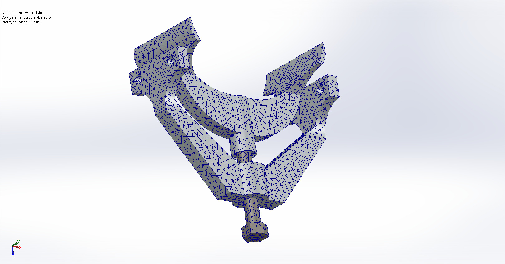
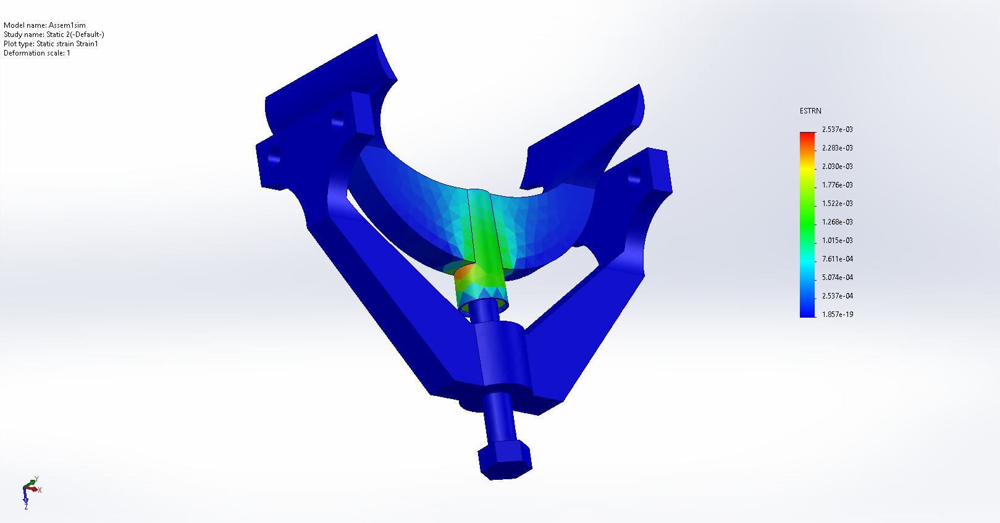
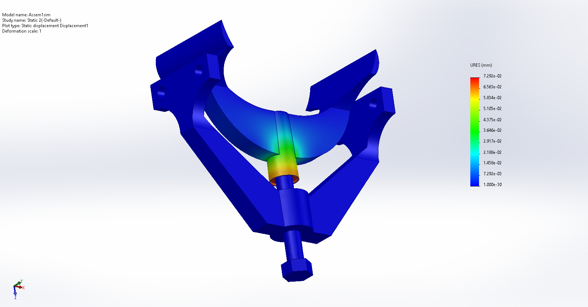

# LSH and LSHS FEA Results

These are the simulation results (using ANSYS) based on my final year research project.

## Initial results on the stock model (no optimization) using SOLIDWORKS Simulation

1. 
   *Stock Model*

2. 
   *Initial simulation results showing stress distribution on the stock model.*
   
3. 
   *Initial simulation results showing strain on the stock model.*

4. 
   *Displacement analysis of the unoptimized assembly.*
