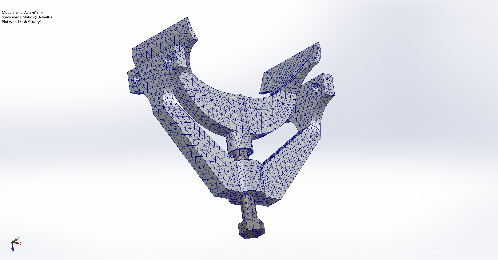
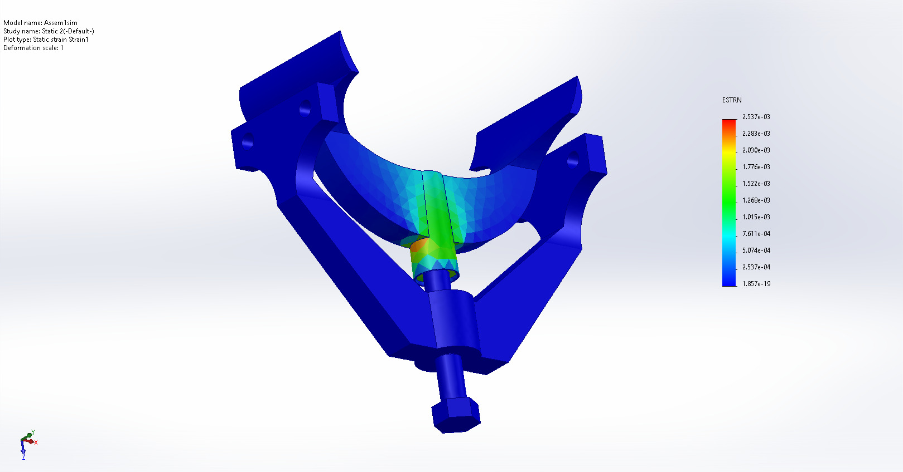
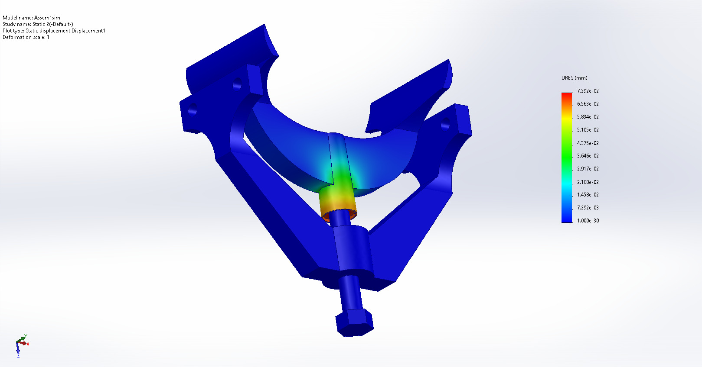

# LSH and LSHS FEA Results based on my undergraduate final year research project.

 
   *Stock Model*

## Initial results on the stock model (not optimized) using SOLIDWORKS Simulation

1. 
   *Initial simulation results showing stress distribution on the stock model.*
   
2. 
   *Initial simulation results showing strain on the stock model.*

3. 
   *Displacement analysis of the unoptimized assembly.*

## These are the simulation results using ANSYS 
